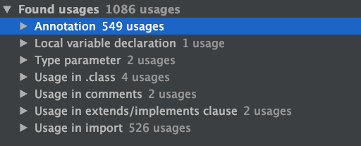

# RemoveLomboks

目前项目中引用的org.projectlombok:lombok库（主要用于通过注解为data类自动生成getter/setter方法），对gradle build plugin 3.2.1+以上的kapt以及annotationProcessor支持都非常不友好，stackoverflow及github上都能找到相关的issue。

这个问题导致我们无法升级gradle build plugin版本，且考虑到lombok用处也并不是特别大，因此最近考虑将lombok库从项目中移除。

然鹅。。搜一搜项目中引用lombok的类吧：

可怕。。

好几百个类，这还只是引用lombok.Data的。

所以，为了不让自己眼睛瞎掉，我们先来想想，怎么用自动化批量修改的方式，来做这个事情。

参考人工修改的逻辑，思路大致如下：

1. @Data

- [x] ~~为了避免有重名的类，导致替换出错，先扫一遍看有import lombok的类是否有重名的，如果没有，直接替换，否则要手动检查~~ --> 更新：有重名的lombok类其实没事儿，只要所有的lombok类全都处理了*

- [x] 处理有import lombok.Data的类，

- 删掉import lombok.Data;那一行，

- 删掉@Data那一行，

- 将其所有属性都修改为public，

- 将调用本类（即前一个字符为空格）的setXxx(...)都替换为this.xxx = ... ，

- ~~（暂未发现调用本类getter方法的地方，先不考虑）~~

- 记住包名和类名 a.b.c.DataA；

- [x] 遍历指定目录下的所有文件，查找有import a.b.c.DataA的类，或者和DataA在同一目录下、并有直接引用DataA的类；

- [x] 在找到的类中，找到类型为DataA的变量名dataA，把dataA.isXxx、dataA.getXxx都替换成dataA.xxx，将dataA.setXxx替换为 dataA.xxx=... 。

2. @Setter

3. @Getter

4. @EqualsAndHashCode